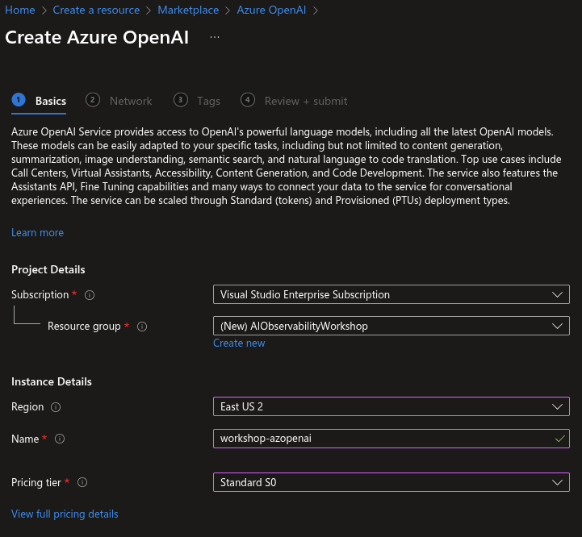
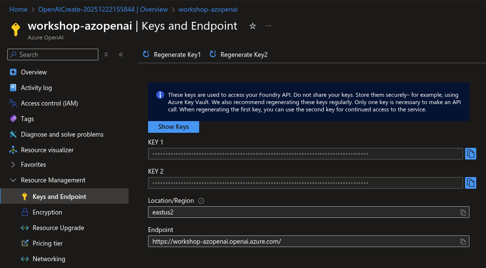
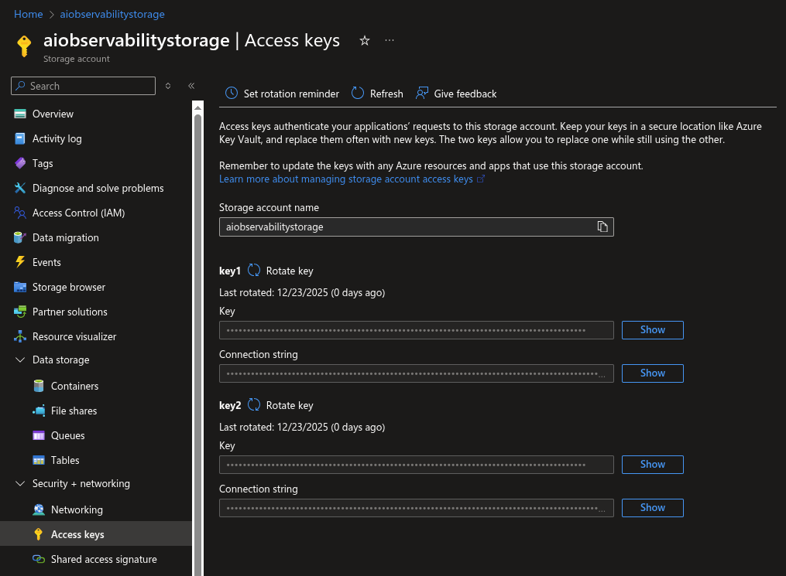
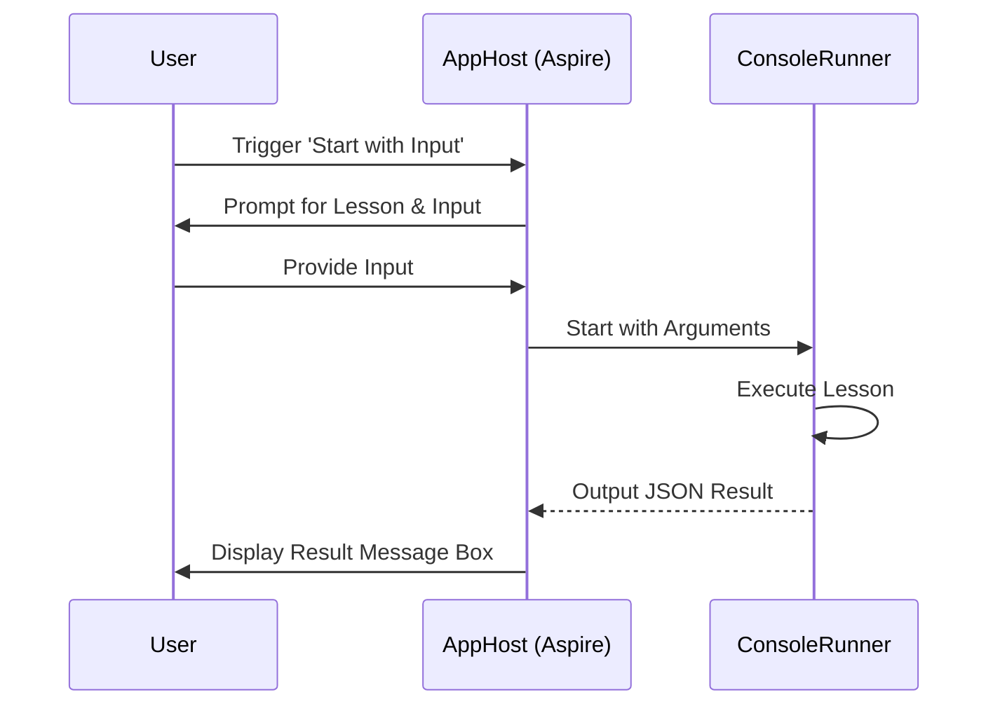

# AI Observability and Evaluation Workshop

Conducted by Matt Eland and Victor Frye from [Leading EDJE](https://LeadingEDJE.com)

See [AGENDA.md](AGENDA.md) for the workshop schedule and exercises.

## Setup and Requirements

To get rolling with this workshop you'll need a few key things:

- [The Repository Cloned Locally](https://github.com/IntegerMan/AIObservabilityAndEvaluationWorkshop)
- [.NET 10.0 SDK](https://dotnet.microsoft.com/en-us/download/dotnet/10.0)
- [Tooling compatible with Aspire (VS 2022 / 2026), VS Code, Rider, Cursor, etc.](https://learn.microsoft.com/en-us/dotnet/aspire/fundamentals/setup-tooling)
- Either [Docker Desktop](https://www.docker.com/products/docker-desktop) or [Podman](https://podman.io/) installed locally. Note that licensing for Docker Desktop may be problematic on corporate machines.

You will likely optionally want to use a cloud resource for your LLM. This workshop supports Azure OpenAI and OpenAI (and compatible endpoints) resources. A small portion of this workshop does use Microsoft Foundry and requires Identity Authentication. If you run the examples with other models, you will likely encounter errors but still be able to get an educational experience looking at the responses from the LLMs. This document will walk you through the optional configuration steps for Microsoft Foundry if you'd like and we'll demo the Foundry components live if you want to see the non-erroring version without the fuss of additional setup.

We recommend launching the application in advance with a stable internet connection to allow the appropriate container images to be downloaded.

## Detailed Setup Instructions

Aside from the Azure Content Safety portion, all workshop contents can be run using local models via Ollama, using advanced cloud-based models will provide more accurate evaluations and better overall performance.

We've noticed that while llama3.2 is a lovely model that's capable of running on most machines, it is a slow beast and it can be confused by more complex prompts such as those used by a few of the evaluators.

To avoid this, we recommend using an OpenAI or Azure OpenAI deployed gpt-4o model to take advantage of faster generation speeds. Using Azure also allows you to get good responses from the portions of this workshop that use evaulators that rely on Azure Content Moderation, which require Microsoft Foundry.

> [!NOTE]
> OpenAI and Azure resources have an associated cost, including per-use costs with the base model LLMs. Monitor your usage and set up budget alerts if necessary.

#### Setting up Azure OpenAI without Microsoft Foundry

1. **Search the Marketplace**: In the Azure Portal, search for "Azure OpenAI" in the Marketplace.

   

2. **Create the Resource**: Create a new Azure OpenAI resource. We recommend creating a new resource group for this workshop to make cleanup easier later.

   

3. **Get Keys and Endpoints**: Once the resource is created, navigate to **Keys and Endpoint** under Resource Management. You will need your Endpoint and one of your Keys.

   

4. **Deploy a Model**: Navigate to **Model deployments** and click **Manage Deployments** to open Azure AI Foundry (formerly Azure AI Studio). Create a new deployment. We strongly recommend using **gpt-4o**, which MEAI Evaluation recommends as a tested library, and keeping the default deployment name.

   

Now that you have these resources deployed, take your endpoint, API key, and deployment name and use them in the `AIEndpoint`, `AIKey`, and `AIModel` settings in `appsettings.json`. Also set `AIProvider` to `Azure`.

A sample valid config file follows:

```json
  "ParametersAZ": {
    "AIUseAzureIdentity": "false",
    "AIProvider": "Azure",
    "AIModel": "gpt-4o",
    "AIKey": "YourKeyHere",
    "AIEndpoint": "https://YourResourceName-resource.cognitiveservices.azure.com/",
    "AIFoundryProjectEndpoint": ""
  },
```

Note that you will encounter some errors when running content safety evaluators during a small part of the workshop.

### Using Microsoft Foundry on Azure

Using Microsoft Foundry and identity authentication should allow you to run all parts of the workshop without errors. Microsoft Foundry also gives you access to some additional analytics around your deployed models which will be interesting as well.

To get started, go to [AI.Azure.com](https://ai.azure.com) and authenticate using your Azure account.

Then create a new project, specifying a Microsoft Foundry resource (not an AI Hub) and enter the details for your project.


> [!NOTE]
> **Important:** You should select `East US 2` as your region as some of the features we're working with are in preview and only available in this region.

Next, go to **Models + endpoints** in the sidebar and choose to deploy a new base model. We'll need an instance of `gpt-4o` for this workshop as it is the resource Microsoft has tested the evaluations library the most with.

For deployment type, I usually select Global Standard or Standard if I have data residency concerns.

Once this is complete, go to the Overview page of the resource to find your Azure OpenAI endpoint as shown here:


You should use your **Microsoft Foundry project endpoint** setting in the `AIFoundryProjectEndpoint` setting in `appsettings.json` (or in User Secrets) for the `AIObservabilityAndEvaluationWorkshop.AppHost` project.

The **Azure OpenAI Endpoint** also goes in the `appsettings.json` file (or user secrets) as your `AIEndpoint`. You'll also want to use `Azure` as your `AIProvider`. Additionally, your API Key will go into the `AIKey` setting if you're not planning on using Identity authentication (needed for content safety features).

If you want to also be able to run the content safety evaluators without error, you'll need to configure identity authentication for your new Microsoft Foundry resource.

#### Setting up identity authentication with Azure

If you plan on using identity authentication, your user will need to have the **Cognitive Services OpenAI User** and **Cognitive Services User** roles on your Microsoft Foundry resource.

You can do this by going to the resource in the Azure Portal, selecting **Access control (IAM)** on the sidebar, and then clicking **Add role assignment**.

Next, search for **Cognitive Services OpenAI User**, select it, and click Next.


Now select your user and click the various buttons to review and accept the role assignment.


Do this same process again for the **Cognitive Services User** role.

You'll now need to finalize configuration for your resources in `appsettings.json` to specify identity authentication. A sample valid config section follows:

```json
  "ParametersAZ": {
    "AIUseAzureIdentity": "true",
    "AIProvider": "Azure",
    "AIModel": "gpt-4o",
    "AIKey": "",
    "AIEndpoint": "https://YourProject-resource.openai.azure.com/",
    "AIFoundryProjectEndpoint": "https://YourProject-resource.services.ai.azure.com/api/projects/YourProject"
  },
```

#### Authenticating with Azure PowerShell for Identity Authentication

In order to set up identity authentication with Azure, you'll need to install [Azure PowerShell](https://learn.microsoft.com/en-us/powershell/azure/install-azure-powershell).

Next, you'll need to find your tenant ID in the Azure portal by going to the Microsoft Entra ID resource and finding the Tenant ID there.


After this, do an `az login --tenant YourTenantId` to log in.

Log in following the dialog box that opens and select your Azure subscription. You are now logged in.

See the **Troubleshooting** section later on for additional materials.

### Using OpenAI or Compatible APIs

If you want to avoid Azure but also don't want to use a local Ollama model, you can use an OpenAI model or OpenAI compatible endpoint with this workshop.

The easiest way of doing this is to use OpenAI itself. Start out by going to the [OpenAI Platform's API Keys page](https://platform.openai.com/api-keys). You may need to authenticate and/or create an account. Creating an account and setting up billing are not covered here in this documentation.

Next, click **Create new secret key**.

Give your key a meaningful name and customize other settings as you need (I've left them at their defaults for this screenshot).


Next, click Create secret key and copy it to your clipboard.

After this, go in to your `appsettings.json` file and customize the parameters section to match your endpoint and key:

```json
  "Parameters": {
    "AIUseAzureIdentity": "false",
    "AIProvider": "OpenAI",
    "AIModel": "gpt-4o",
    "AIKey": "sk-proj-TheRestOfYourKeyGoesHere",
    "AIEndpoint": "",
    "AIFoundryProjectEndpoint": ""
  },
```

Note that with OpenAI itself you can leave AIEndpoint empty and OpenAI will be assumed. If you're using an OpenAI compatible endpoint, you can customize the AIEndpoint and use that custom resource, but you'll have to get a key some other way.

Also note that Microsoft Foundry and Idenitity authentication is required for some of the examples in the workshop. You'll still be able to run the examples and get responses from LLMs in your logs, but you'll see an error.

### Configuring Report Storage

By default, evaluation reports are stored on your local disk in the `Reports` directory relative to the project root.

- **To change the local reports path**: Update `ReportsPath` in `appsettings.json`.
- **To change the local evaluation results path**: Update `EvaluationResultsPath` in `appsettings.json`.

This will be fine for the workshop and you don't need to worry about it in advance. However, if you'd like to see how to configure Azure storage, that's listed here as well.

#### Azure Storage for Reporting (Highly Optional / Not Recommended)

NOTE: This portion adds little value to the workshop and is intended for reference purposes later on.

If you prefer, you can store reports in Azure Storage (Data Lake Gen2).

1.  **Create a Storage Account**: In the Azure Portal, create a new Storage Account. Ensure that **Hierarchical namespace** is enabled (under the **Advanced** tab) to enable Data Lake Storage Gen2.


2. **Create a Container**: Navigate to **Containers** in your new storage account and create a new container (e.g., `reports`). 


4. **Get the Connection String**: Navigate to **Access keys** under **Security + networking** in your storage account. Click **Show** and copy one of the **Connection string** values.



**To use Azure Storage**: 

1. Set `ReportStorageType` to `"azure"`.
2. Set `AzureStorageDataLakeEndpoint` to your storage account's Data Lake Endpoint.
3. Set `AzureStorageContainer` to your container name.

```json
{
  "Parameters": {
    "ReportStorageType": "azure",
    "AzureStorageDataLakeEndpoint": "https://yourstorageaccount.dfs.core.windows.net/",
    "AzureStorageContainer": "your-container"
  }
}
```

You will need to have identity authentication enabled and the `Storage Blob Data Contributor` role assigned to your user for your storage account. See the identity authentication section for more details on this process. 

### Troubleshooting

Here are a few tricky issues you may encounter when running the workshop code.

#### Identity Authentication on Azure

If you want to use Azure models with identity authentication (required for the content safety evaluators to succeed), you must authenticate using identity authentication.

Microsoft provides a helpful guide to common errors here: [Troubleshooting Azure Identity](https://aka.ms/azsdk/net/identity/defaultazurecredential/troubleshoot )

#### AI Evaluation SDK Troubleshooting

Microsoft has provided a helpful [troubleshooting guide](https://github.com/Azure/azure-sdk-for-python/blob/main/sdk/evaluation/azure-ai-evaluation/TROUBLESHOOTING.md) on their repository which can help with some issues and specific errors.

This is particularly helpful for safety evaluator configuration issues.

#### Inotify Limit Error on Linux

If you encounter the error:
```
System.IO.IOException: The configured user limit (128) on the number of inotify instances has been reached
```

This is a Linux system limitation. The Aspire AppHost creates file watchers for configuration files, which can exceed the default inotify limit.

**Solution:** Increase the system inotify limit:

```bash
# Temporary (until reboot)
sudo sysctl -w fs.inotify.max_user_instances=512

# Permanent
echo "fs.inotify.max_user_instances=512" | sudo tee -a /etc/sysctl.conf
sudo sysctl -p
```

Alternatively, you can run the provided helper script:
```bash
./fix-inotify-limit.sh
```

#### SSL Connection Issues (UntrustedRoot) on Linux

If you are running on a machine with an SSL-inspecting proxy (common in some corporate environments or workshops) and you get an exception similar to:
`System.Security.Authentication.AuthenticationException: The remote certificate is invalid because of errors in the certificate chain: UntrustedRoot`

**Solution:** Enable the `AllowUntrustedCertificates` parameter.

1. Locate the `AIObservabilityAndEvaluationWorkshop.AppHost/appsettings.json` file.
2. Under the `Parameters` section, set `"AllowUntrustedCertificates"` to `"true"`.

```json
{
  "Parameters": {
    "AllowUntrustedCertificates": "true"
  }
}
```

This will configure the application to bypass certificate validation for Azure and OpenAI connections.

## Technical Details: User Interaction

This project uses .NET Aspire's Interaction Service to facilitate communication between the user and the console application via the Aspire Dashboard.

### Interaction Flow

1. **User Input**: The user triggers the `start-with-input` command on the `console-app` resource in the Aspire Dashboard.
2. **Prompts**: `AppHost` uses `IInteractionService` to display input dialogs to the user for lesson selection and any required text input.
3. **Execution**: The inputs are passed as command-line arguments to the `ConsoleRunner` project, which is then started.
4. **Capturing Output**: The `ConsoleRunner` performs its task and outputs a JSON-formatted result to the standard output. `AppHost` captures this using `WithOutputWatcher` and a regular expression.
5. **Displaying Results**: `AppHost` deserializes the JSON and uses `IInteractionService.PromptMessageBoxAsync` to display the final result (or error) back to the user in the dashboard.



For more details on the implementation, see `AIObservabilityAndEvaluationWorkshop.AppHost/AppHost.cs`.

## Additional Resources

See the following blog posts or other resources on related topics of interest on things in this workshop:

- [Microsoft.Extensions.AI.Evaluation Documentation](https://learn.microsoft.com/en-us/dotnet/ai/evaluation/libraries) - official documentation
- [An LLM Evaluation Framework for AI Systems Performance](https://blog.leadingedje.com/post/ai/evaluation.html) - blog post by [Matt Eland](https://MattEland.dev) on **MEAI Evaluation**
- [Tracking AI System Performance using AI Evaluation Reports](https://blog.leadingedje.com/post/ai/evaluationreporting.html) - blog post by [Matt Eland](https://MattEland.dev) on **MEAI Evaluation Reporting**