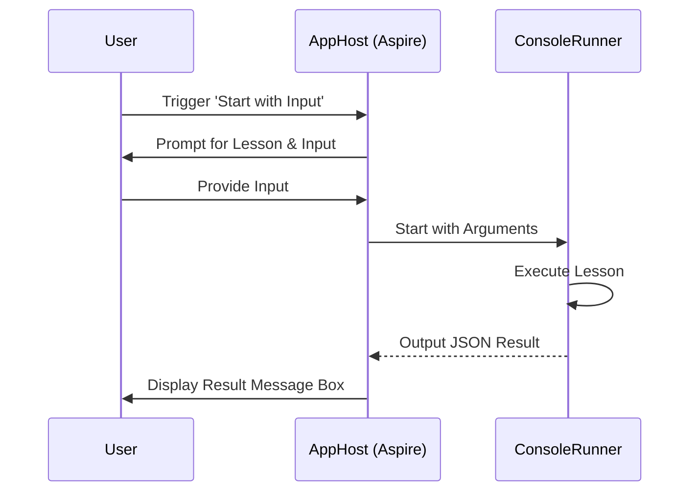

# AI Observability and Evaluation Workshop

Conducted by Matt Eland and Victor Frye from [Leading EDJE](https://LeadingEDJE.com)

See [AGENDA.md](AGENDA.md) for the workshop schedule and exercises.

## Setup and Requirements

- [.NET 10.0 SDK](https://dotnet.microsoft.com/en-us/download/dotnet/10.0)
- [Tooling compatible with Aspire (VS 2022 / 2026), VS Code, Rider, Cursor, etc.](https://learn.microsoft.com/en-us/dotnet/aspire/fundamentals/setup-tooling)

Some examples will use containerized resources. For these you will need either:

- [Docker Desktop](https://www.docker.com/products/docker-desktop) * licensing may not be advisable on corporate machines
- [Podman](https://podman.io/)

We recommend launching the application in advance with a stable internet connection to allow the appropriate container images to be downloaded.

### Azure Cloud Resources (Optional)

While this workshop can be run using local models via Ollama, using advanced cloud-based models will provide more accurate evaluations and better overall performance. We recommend setting up an Azure OpenAI resource if you have access to one.

> [!NOTE]
> Azure resources may have an associated cost, including per-use costs with the base model LLMs. Monitor your usage and set up budget alerts if necessary.

#### Setting up Azure OpenAI

1. **Search the Marketplace**: In the Azure Portal, search for "Azure OpenAI" in the Marketplace.

   

2. **Create the Resource**: Create a new Azure OpenAI resource. We recommend creating a new resource group for this workshop to make cleanup easier later.

   

3. **Get Keys and Endpoints**: Once the resource is created, navigate to **Keys and Endpoint** under Resource Management. You will need your Endpoint and one of your Keys.

   

4. **Deploy a Model**: Navigate to **Model deployments** and click **Manage Deployments** to open Azure AI Foundry (formerly Azure AI Studio). Create a new deployment. We recommend using **gpt-5.2-chat** (or the latest available GPT-4o variant if gpt-5.2 is not yet available) and keeping the default deployment name.

   
   

#### Configuring the Application

To use your Azure OpenAI deployment, update the `AIObservabilityAndEvaluationWorkshop.AppHost/appsettings.json` file.

> [!WARNING]
> Your `AIKey` is sensitive information. **Never commit your API key to version control.**

#### Using User Secrets (Recommended)

Instead of putting your key in `appsettings.json`, we recommend using [.NET User Secrets](https://learn.microsoft.com/en-us/aspnet/core/security/app-secrets?view=aspnetcore-9.0&tabs=linux) to store your sensitive configuration locally.

To set your key using the command line, run the following from the `AIObservabilityAndEvaluationWorkshop.AppHost` directory:

```bash
dotnet user-secrets set "Parameters:AIKey" "your-key-goes-here"
```

#### Manual Configuration

If you choose to use `appsettings.json`, update the following fields:

1. Change `AIProvider` to `"AzureOpenAI"`.
2. Change `AIModel` to your deployment name (e.g., `"gpt-5.2-chat"`).
3. Set `AIEndpoint` to your Azure OpenAI endpoint URL.
4. Set `AIKey` to your Azure OpenAI key.

```json
{
  "Parameters": {
    "AIProvider": "AzureOpenAI",
    "AIModel": "gpt-5.2-chat",
    "AIEndpoint": "https://your-resource-name.openai.azure.com/",
    "AIKey": "your-key-goes-here"
  }
}
```

Alternatively, if you have the Azure CLI installed and are logged in, you can set `AIUseAzureIdentity` to `"true"` and leave `AIKey` blank to use Managed Identity / Entra ID authentication.

### Configuring Report Storage

By default, evaluation reports are stored on your local disk in the `Reports` directory relative to the project root.

- **To change the local reports path**: Update `ReportsPath` in `appsettings.json`.
- **To change the local evaluation results path**: Update `EvaluationResultsPath` in `appsettings.json`.

#### Azure Storage for Reporting (Optional)

If you prefer, you can store reports in Azure Storage (Data Lake Gen2).

1.  **Create a Storage Account**: In the Azure Portal, create a new Storage Account. Ensure that **Hierarchical namespace** is enabled (under the **Advanced** tab) to enable Data Lake Storage Gen2.


2. **Create a Container**: Navigate to **Containers** in your new storage account and create a new container (e.g., `reports`). 


4. **Get the Connection String**: Navigate to **Access keys** under **Security + networking** in your storage account. Click **Show** and copy one of the **Connection string** values.


**To use Azure Storage**: 

1. Set `ReportStorageType` to `"azure"`.
2. Set `AzureStorageConnectionString` to your storage account connection string.
3. Set `AzureStorageContainer` to your container name.

```json
{
  "Parameters": {
    "ReportStorageType": "azure",
    "AzureStorageConnectionString": "DefaultEndpointsProtocol=https;AccountName=youraccount;AccountKey=yourkey;EndpointSuffix=core.windows.net",
    "AzureStorageContainer": "your-container"
  }
}
```

### Troubleshooting

Here are a few tricky issues you may encounter when running the workshop code.

#### Inotify Limit Error on Linux

If you encounter the error:
```
System.IO.IOException: The configured user limit (128) on the number of inotify instances has been reached
```

This is a Linux system limitation. The Aspire AppHost creates file watchers for configuration files, which can exceed the default inotify limit.

**Solution:** Increase the system inotify limit:

```bash
# Temporary (until reboot)
sudo sysctl -w fs.inotify.max_user_instances=512

# Permanent
echo "fs.inotify.max_user_instances=512" | sudo tee -a /etc/sysctl.conf
sudo sysctl -p
```

Alternatively, you can run the provided helper script:
```bash
./fix-inotify-limit.sh
```

#### SSL Connection Issues (UntrustedRoot) on Linux

If you are running on a machine with an SSL-inspecting proxy (common in some corporate environments or workshops) and you get an exception similar to:
`System.Security.Authentication.AuthenticationException: The remote certificate is invalid because of errors in the certificate chain: UntrustedRoot`

**Solution:** Enable the `AllowUntrustedCertificates` parameter.

1. Locate the `AIObservabilityAndEvaluationWorkshop.AppHost/appsettings.json` file.
2. Under the `Parameters` section, set `"AllowUntrustedCertificates"` to `"true"`.

```json
{
  "Parameters": {
    "AllowUntrustedCertificates": "true"
  }
}
```

This will configure the application to bypass certificate validation for Azure and OpenAI connections.

## Technical Details: User Interaction

This project uses .NET Aspire's Interaction Service to facilitate communication between the user and the console application via the Aspire Dashboard.

### Interaction Flow

1. **User Input**: The user triggers the `start-with-input` command on the `console-app` resource in the Aspire Dashboard.
2. **Prompts**: `AppHost` uses `IInteractionService` to display input dialogs to the user for lesson selection and any required text input.
3. **Execution**: The inputs are passed as command-line arguments to the `ConsoleRunner` project, which is then started.
4. **Capturing Output**: The `ConsoleRunner` performs its task and outputs a JSON-formatted result to the standard output. `AppHost` captures this using `WithOutputWatcher` and a regular expression.
5. **Displaying Results**: `AppHost` deserializes the JSON and uses `IInteractionService.PromptMessageBoxAsync` to display the final result (or error) back to the user in the dashboard.



For more details on the implementation, see `AIObservabilityAndEvaluationWorkshop.AppHost/AppHost.cs`.